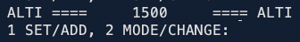

# Hill-Walker-Device
 **Object Oriented Programming Coursework, Second Year of Computer Science**

 ##Scenario
The program must implement the FSM illustrated in Figure 5. As part of this program, design and implement a Java class that represents the wrist device

   Below is a finite state machine. The FSM essentially represents the set of states that the device can be in, with transitions resulting from events and actions produced by one of the two buttons being pressed. Note that when the device is in ‘altimeter’ mode, pressing the ‘set’ button has no effect and the device remains in altimeter mode (this is sometimes referred to as a null transition).

   

 1. The User interaction supports all state transition depicted in Figure 5.

 - &emsp; Below is the prompt with real current time displayed.

   &emsp;&emsp; 

 2. For the purposes of this task the altimeter mode is fixed at value 1500 (metres).

 - &emsp; Below shows the application when the state is 'mode=altimeter'.

   &emsp;&emsp; 
